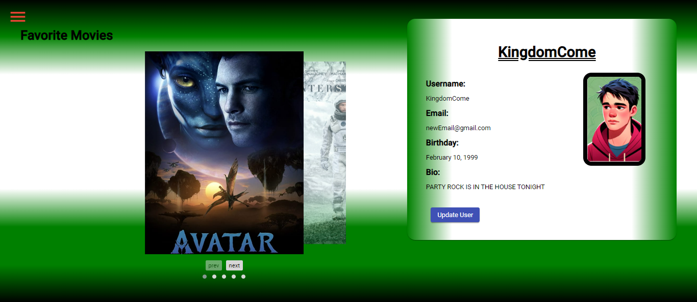
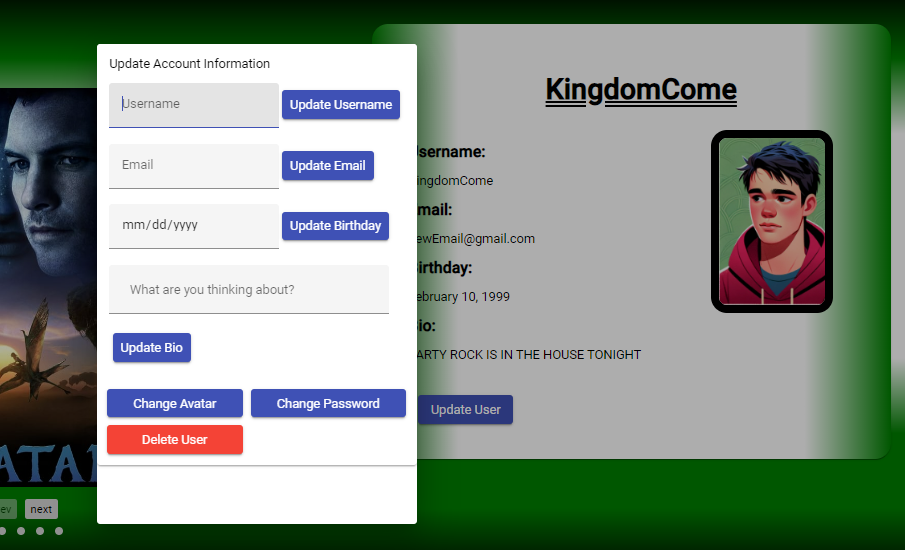

# JeriflixAngularClient
This is a Movie app created using React that allows users to create accounts, log-in, view different available movies
and add or delete movies to their Favorites list. The app also showcases different facts about the movies, directors and genres.

This project was generated with [Angular CLI](https://github.com/angular/angular-cli) version 17.2.0.

## Table of Contents

- [Screenshots](#screenshots)
- [Features](#features)
- [Prerequisites](#prerequisites)
- [Installation](#installation)
- [Build](#build)
- [Running Unit Tests](#running-unit-tests)
- [Running End-To-End Tests](#running-end-to-end-tests)
- [Usage](#usage)
- [Contributing](#contributing)
- [License](#license)

## Screenshots

## Features

- View a variety of movies from different Genres and Directors
- Add or remove movies from YOUR Favorites List
- Learn more about your favorite movie.

### Prerequisites

To run JeriFlix, you need a web browser with JavaScript enabled. Other dependencies are listed under
package.json.

### Installation

1. Clone or download the repository to your local machine.
2. install all dependencies
3. run npm start or expo start

Alternatively:
1. open up the website link: https://lazyjinn1.github.io/Jeriflix-Angular-client/welcome

## Build

Run `ng build` to build the project. The build artifacts will be stored in the `dist/` directory.

## Running unit tests

Run `ng test` to execute the unit tests via [Karma](https://karma-runner.github.io).

## Running end-to-end tests

Run `ng e2e` to execute the end-to-end tests via a platform of your choice. To use this command, you need to first add a package that implements end-to-end testing capabilities.

## Usage

1. Direct yourself to the sign-up page and sign yourself up
2. Head towards log-in and using your newly created credentials, log yourself in.
3. Click and drag through the movie list to see all the different movies, or 
click on the navigations on the bottom of the page
4. Alternatively, you can also search for specific movies at any time by typing into your keyboard
5. Clicking on a movie card details more information on the movie including a description, genre and director.
You can also add and remove movies from your favorites list from here.
6. You can also click on Profile on the navigation menu and be presented to your own personal profile.
8. You can view your favorite movies list here as well as change any information such as your Username, Password, Email, Bio, Profile Picture (generated by AI) or Birthday.
9. Once satisfied, feel free to log-out with the navigation menu's logout button.

## Contributing

Contributions to the Jeriflix App are welcome! If you have any suggestions, bug fixes, or feature enhancements, feel free to open an issue or submit a pull request.

Before contributing, please review the [Code of Conduct](CODE_OF_CONDUCT.md).

## License

Jeriflix is an open-source software licensed under the [MIT License](LICENSE).
